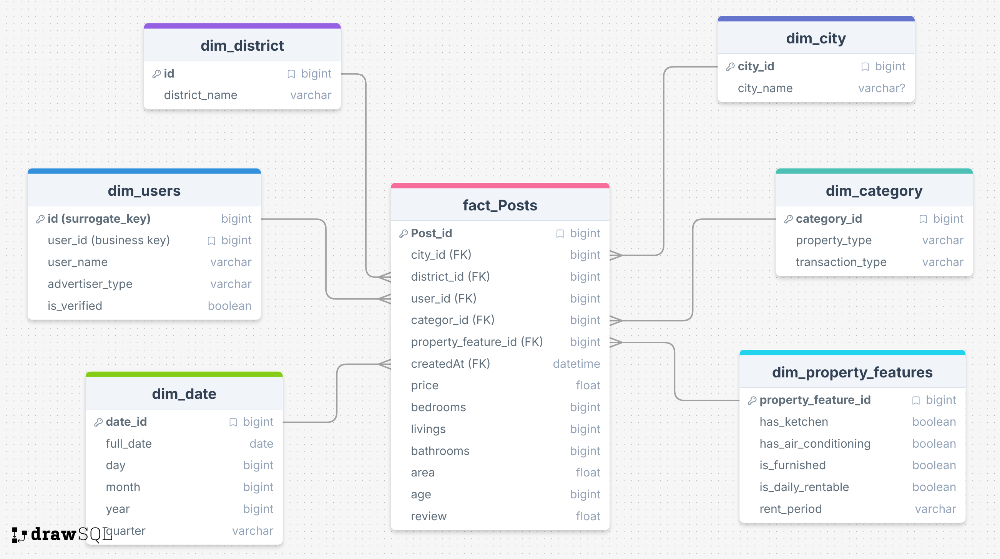

# **Project Overview**
  ### **This project demonstrates a modern data engineering architecture designed to process real estate market data using `a Hybrid Lambda-style approach (Real-time Streaming & Batch Pipelines)`. The system focuses on enriching raw data with Machine Learning to deliver high-priority insights to business stakeholders.**
  ### **Leveraging a `Lakehouse Architecture (Delta Lake)`, the system follows the `Bronze–Silver–Gold` pattern to ensure data reliability, ACID transactions, and schema enforcement**
  ### **The processed data is activated to:**
  -  **`Trigger Real-Time AI Alerts:`** 
     -   **`Urgent Support Path`** : If the AI identifies a **`"Complaint" or "Maintenance Issue"`** the record triggers an immediate high-priority alert to the **Urgent Support Team via the Telegram** Bot API.
     -   **`Sales Lead Path`** : If the AI identifies a **`"Question" or "Pricing Inquiry"`**, the data is enriched with property details and routed to the **Sales Team Telegram** Bot API.
 -   **`Drive Business Intelligence:`** Providing historical market analytics through **`Power BI dashboards.`**
  -  **`Conversational AI Discovery`** Powering an Intelligent **`Chatbot Interface (GPT-style) `** that allows users to interact with the real estate market through natural dialogue.
----
## **The Business Problem**
 Real estate platforms handle massive volumes of **unstructured and structured data**, often leading to three critical failures:
  -  **Response Latency**: Urgent customer grievances are lost in batch processing cycles, damaging brand reputation.
  -  **Missed Revenue**: High-intent sales inquiries are treated as static comments rather than live leads, leading to lost conversion opportunities.
  -  **Search Friction & Information Overload (The Chatbot Problem):** Traditional real estate platforms rely on `Static Filtering` (Price, SQM, Location).
-------
## **Architecture Overview**

-------

## **A. Real-Time Interaction Stream (Unstructured)**
#### This layer serves as the "Brain" of the real-time pipeline, utilizing Apache Spark Structured Streaming and Spark MLlib to perform high-speed inference and multi-dimensional data enrichment.
  - **Source**: User-generated Comments & Complaints
  - **Mechanism**: Ingested via Azure Cosmos DB **Change Feed** (CDC).
  - **Engineering Detail**: This stream captures high-velocity, unstructured Arabic text. It is the primary trigger for the Real-Time AI Routing logic, allowing the system to react to customer
  - **Real-Time AI Inference (NLP)**:The system applies a specialized **Arabic-BERT model** to every incoming event to extract intent and sentiment, where Automatically categorizing messages as **`"Urgent Complaint,"`** or **`"Sales Lead."`**
  - **Data Enrichment**: A raw stream is often **missing the context needed for a team** to take action, so this layer performs a Streaming-to-Static Join to "hydrate" the event with critical metadata: `Phone client, City, District, price, area, and "comment or complaint"`
  - **Sending in near-realtime to Telegram alerts**
## Sales Team

## Urgent Team

----
## **B. Batch Ingestion (Structured)**
- [Data Dictionary:](https://www.kaggle.com/datasets/mohdph/saudi-arabia-real-estate-dataset)
- **Multi-Stage Ingestion** `(Bronze Layer)`
  - **Source:** External REST API
  - **Mechanism:** Scheduled Batch Ingestion via Azure Data Factory (ADF)
  - **Engineering Detail:** Data is ingested into ADLS Gen2 in its raw format
- **Data Transformation** `(Silver Layer)`
    - **Data Deduplication**
    - **Schema Enforcement:** using Delta Lake to enforce a consistent schema and prevent data corruption caused by unexpected API schema changes.
    - **Standardization & Normalization:** Converting abbreviated values and inconsistent labels into standardized and meaningful names.
    - **Missing Value Handling:** `Numerical fields` are filled using the `median` within each logical group, while `categorical` fields are imputed using the most frequent value `mode` within the same group. 
- **Business-Ready Analytics** `(Gold Layer)`
    - **Star Schema Modeling:** Data is organized into optimized Fact and Dimension tables.
    - **Historical Data for Users:** slowly changing dimension (SCD2)
    - 
---

### We use Table Format: 
  - **Using Delta Lake to support ACID transactions, data auditing, schema evolution, schema enforcement, and table versioning.**
    

## ${\textsf{\color{blue} Challenges Overcome Engineering}}$

**${\textsf{\color{red}Challenge}}$:** Full Load Across All Layers

**${\textsf{\color{green}Solution}}$:** the pipeline utilizes `Delta Change Data Feed (CDF).`
  - **Efficiency:** By enabling delta.enableChangeDataFeed = true, we only process the changes (inserts/updates/deletes) between versions.
  - **Cost Optimization:** This reduces I/O overhead and `no need full MERGE operations` because we simply start with condition about version if ( last_version<current_version )
  - **Idempotency:** Ensures that only failed tasks are retried during pipeline failures without reprocessing successfully completed steps.

**${\textsf{\color{red}Challenge}}$:** `hardcoded` to manage all metadata for all tables that apply incremental loading using versions of CDF

**${\textsf{\color{green}Solution}}$:** `Custom Package` Architecture (Abstraction Layer) To ensure `reusability and maintainability`

**${\textsf{\color{red}Challenge}}$:** `High coupling` between transformation logic within each layer.

**${\textsf{\color{green}Solution}}$:** Introducing `micro-layers` inside each layer to isolate responsibilities, improve modularity, and simplify maintenance.

**${\textsf{\color{red}Challenge in Spark}}$:**
  - The transformation took  ${\textsf{\color{red}25 minute}}$ and with the last transformation occured ${\textsf{\color{red}out of memory}}$

