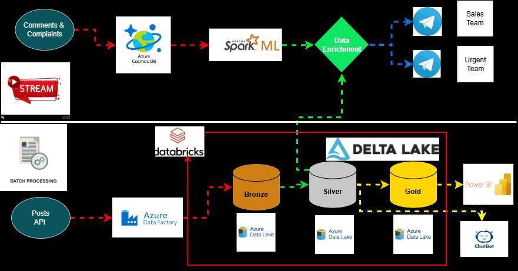

# **Project Overview**
  ### **This project demonstrates a modern data engineering architecture designed to process real estate market data using `a Hybrid Lambda-style approach (Real-time Streaming & Batch Pipelines)`. The system focuses on enriching raw data with Machine Learning to deliver high-priority insights to business stakeholders.**
  ### **Leveraging a `Lakehouse Architecture (Delta Lake)`, the system follows the `Bronze–Silver–Gold` pattern to ensure data reliability, ACID transactions, and schema enforcement**
  ### **The processed data is activated to:**
  -  **`Trigger Real-Time AI Alerts:`** 
     -   **`Urgent Support Path`** : If the AI identifies a **`"Complaint" or "Maintenance Issue"`** the record triggers an immediate high-priority alert to the **Urgent Support Team via the Telegram** Bot API.
     -   **`Sales Lead Path`** : If the AI identifies a **`"Question" or "Pricing Inquiry"`**, the data is enriched with property details and routed to the **Sales Team Telegram** Bot API.
 -   **`Drive Business Intelligence:`** Providing historical market analytics through **`Power BI dashboards.`**
  -  **`Conversational AI Discovery`** Powering an Intelligent **`Chatbot Interface (GPT-style) `** that allows users to interact with the real estate market through natural dialogue.
----
## **The Business Problem**
 Real estate platforms handle massive volumes of unstructured and structured data, often leading to three critical failures:
  -  **Response Latency**: Urgent customer grievances are lost in batch processing cycles, damaging brand reputation.
  -  **Missed Revenue**: High-intent sales inquiries are treated as static comments rather than live leads, leading to lost conversion opportunities.
  -  **Search Friction & Information Overload (The Chatbot Problem):** Traditional real estate platforms rely on `Static Filtering` (Price, SQM, Location).
-------
## **Architecture Overview**

-------

## Data Sources & Ingestion Strategy

### **A. Real-Time Interaction Stream (Unstructured)**
#### This layer serves as the "Brain" of the real-time pipeline, utilizing Apache Spark Structured Streaming and Spark MLlib to perform high-speed inference and multi-dimensional data enrichment.
  - **Source**: User-generated Comments & Complaints
  - **Mechanism**: Ingested via Azure Cosmos DB **Change Feed** (CDC).
  - **Engineering Detail**: This stream captures high-velocity, unstructured Arabic text. It is the primary trigger for the Real-Time AI Routing logic, allowing the system to react to customer
  - **Real-Time AI Inference (NLP)**:The system applies a specialized **Arabic-BERT model** to every incoming event to extract intent and sentiment, where Automatically categorizing messages as **`"Urgent Complaint,"`** or **`"Sales Lead."`**
  - **Data Enrichment**: A raw stream is often **missing the context needed for a team** to take action, so this layer performs a Streaming-to-Static Join to "hydrate" the event with critical metadata: Phone client, City, District, price, area, and comment or complaint

## Sales Team

## Urgent Team

    
### **B. Posts (Structured Batch)**
  - **Source**:External REST API
  - **Mechanism**: Scheduled Batch Ingestion via Azure Data Factory (ADF)

